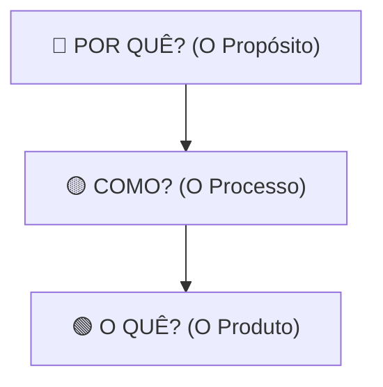

# 🪙 Finpop — Planejamento Financeiro Simplificado

> "Planeje hoje. Conquiste amanhã."

O **Finpop** é uma plataforma educacional e interativa de finanças pessoais desenvolvida com o objetivo de descomplicar a relação das pessoas com o dinheiro. Por meio de trilhas de conhecimento e ferramentas práticas, transformamos a organização financeira em um hábito leve, intuitivo e acessível.

---

## 🎯 Apresentação do Projeto (O Círculo de Ouro / Golden Circle)

Utilizamos a metodologia do Círculo de Ouro de Simon Sinek para definir a essência do Finpop:



### 1. 🔴 Por quê? (Propósito)
Acreditamos que a educação financeira não deve ser um privilégio de especialistas nem uma tarefa maçante e cheia de termos técnicos complexos. O Finpop existe para **democratizar o conhecimento financeiro**, quebrando as barreiras da complexidade e dando autonomia para que as pessoas assumam o controle das suas próprias vidas e realizem seus sonhos sem o peso das dívidas.

### 2. 🟡 Como? (Processo)
Fazemos isso unindo **educação gamificada** e **ferramentas interativas simplificadas**. Traduzimos conceitos complexos (como juros compostos, inflação e distribuição orçamentária) em interfaces amigáveis, eliminando planilhas confusas e oferecendo retornos dinâmicos baseados no comportamento do usuário.

### 3. 🟢 O quê? (Produto)
Uma plataforma web moderna e integrada, composta por:
*   **Quiz Educativo Interativo:** Testes rápidos que avaliam o conhecimento do usuário e ensinam conceitos essenciais com feedbacks imediatos.
*   **Calculadora Orçamentária 50-30-20:** Uma planilha automatizada que divide as receitas e despesas de forma inteligente.
*   **Simulador e Gestor de Metas:** Um painel para criação, simulação e acompanhamento de objetivos financeiros de curto, médio e longo prazo, mostrando a evolução e o esforço mensal necessário.

---

## 👥 Público-Alvo

O Finpop foi estruturado para atender:
*   **Jovens e adultos** iniciando sua trajetória no mercado de trabalho ou buscando independência financeira.
*   **Pessoas com pouco ou nenhum conhecimento formal** sobre finanças e economia.
*   **Usuários que buscam ferramentas práticas** para organizar a rotina financeira diária de forma simples e direta, sem burocracia.

---

## 🛠️ Tecnologias Utilizadas

O ecossistema do Finpop foi projetado utilizando o modelo de desenvolvimento modular moderno:

### Frontend
*   **React (v19):** Biblioteca base para a construção da interface do usuário de forma reativa e baseada em componentes.
*   **Vite:** Ferramenta de build ultra-rápida para o ambiente de desenvolvimento React.
*   **React Router Dom (v7):** Gerenciador de rotas para navegação client-side fluida (SPA) sem recarregamento de página.
*   **CSS Modules:** Estilização encapsulada por componentes, evitando conflitos de classes globais.

### Backend
*   **Node.js & Express (v5):** Servidor HTTP e framework minimalista para criação da API RESTful de serviços.
*   **JSON Web Tokens (JWT):** Mecanismo de autenticação seguro e stateless para sessões de usuários.
*   **BcryptJS:** Hashing criptográfico robusto para garantir o armazenamento seguro de senhas de usuários.
*   **PostgreSQL (`pg` pool):** Banco de dados relacional robusto para o armazenamento persistente de usuários, histórico de quiz, orçamentos e metas.

---

## 🏗️ Arquitetura do Sistema

O projeto segue a **Arquitetura Cliente-Servidor Desacoplada**:

```
+-----------------------------------+             +-----------------------------------+
|             FRONTEND              |             |              BACKEND              |
|        (React SPA / Vite)         | <=========> |         (Express API REST)        |
|  - Gerenciamento de Estado (Context) |  HTTP/JSON  |  - Roteamento e Handlers          |
|  - Navegação Client-Side          |             |  - Middleware de Auth (JWT)       |
+-----------------------------------+             +-----------------------------------+
                                                            ^
                                                            | pg Pool / SQL
                                                            v
                                                  +-----------------------------------+
                                                  |            DATABASE               |
                                                  |          (PostgreSQL)             |
                                                  +-----------------------------------+
```

### Divisão de Pastas
*   `/frontend`: Contém a interface do usuário em React.
    *   `/src/components`: Componentes compartilhados de interface (Header, Footer).
    *   `/src/context`: Contextos globais (como autenticação centralizada).
    *   `/src/pages`: As telas da aplicação (Home, Quiz, Planejamento, Login, Cadastro).
*   `/backend`: Contém a API RESTful de integração.
    *   `/src/config`: Inicialização do pool de conexão com o banco.
    *   `/src/database`: Estruturação das tabelas SQL relacionais.
    *   `/src/middlewares`: Filtros de requisição (ex: validação de token).
    *   `/src/routes`: Endpoints da API divididos por domínio de negócio.
